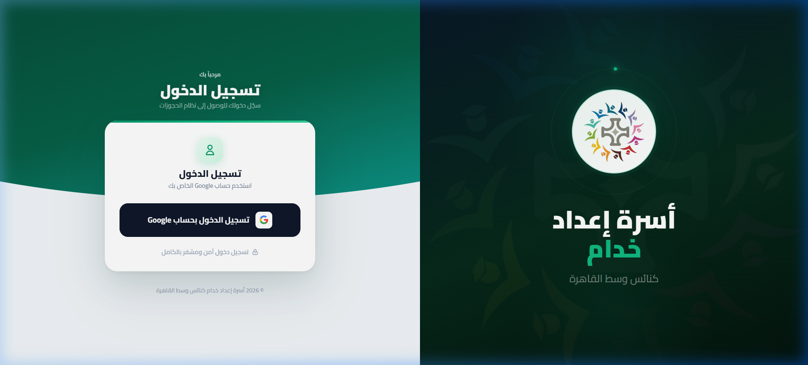
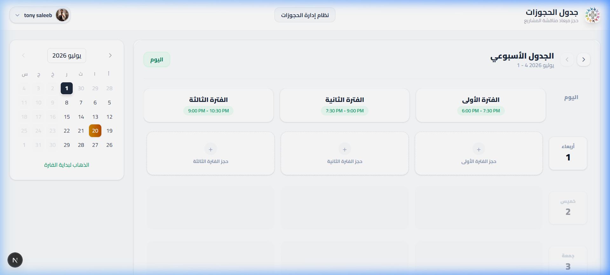
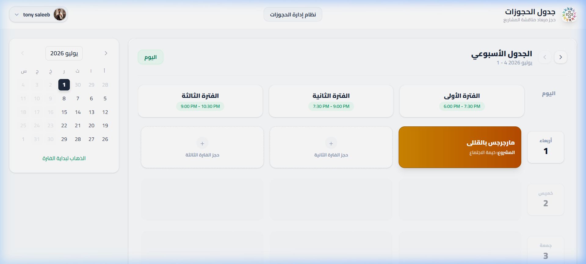
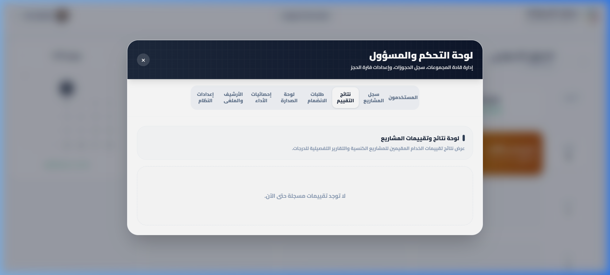
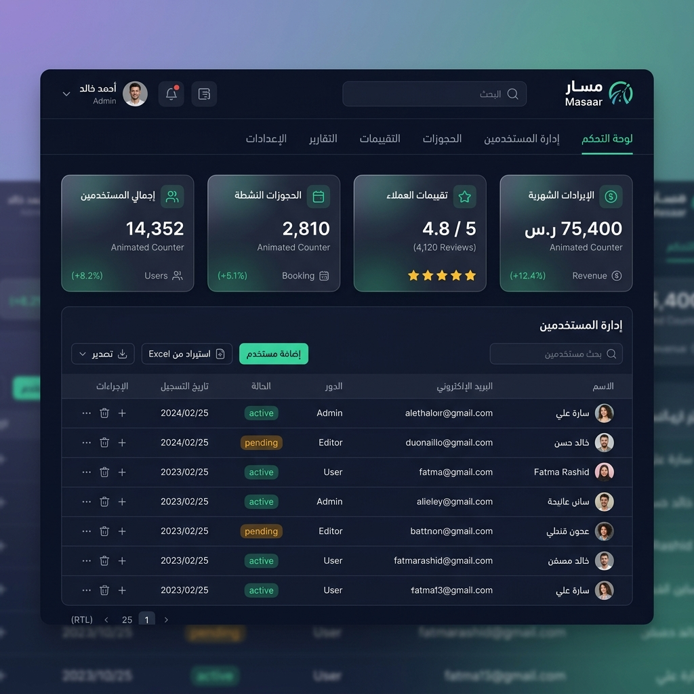
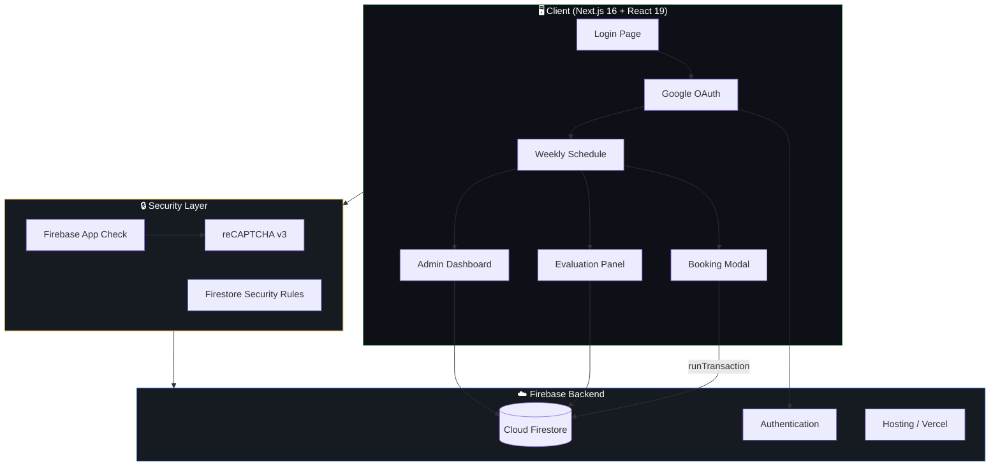

<div align="center">

<!-- GitHub Theme-Aware Hero Banner -->
<picture>
  <source media="(prefers-color-scheme: dark)" srcset="docs/screenshots/dark-preview.png">
  <source media="(prefers-color-scheme: light)" srcset="docs/screenshots/light-preview.png">
  
</picture>

<br/>

# ⛪ إعداد خدام — 5odam

**A premium, real-time Church Facility Scheduling & Project Evaluation platform**

Built for the **Servants Preparation Family** (أسرة إعداد خدام كنائس وسط القاهرة)

[](https://e3dad-5odam.vercel.app)
[](https://nextjs.org)
[](https://firebase.google.com)
[](https://www.typescriptlang.org)
[](https://vercel.com)
[](LICENSE)

<br/>

[**Live App →**](https://e3dad-5odam.vercel.app) · [**Report Bug**](https://github.com/tony-saleeb/e3dad-5odam/issues) · [**Request Feature**](https://github.com/tony-saleeb/e3dad-5odam/issues)

</div>

<br/>

---

<br/>

## 📸 Screenshots

<div align="center">

### 🔐 Secure Google Authentication



<br/><br/>

### 🗓️ Interactive Weekly Schedule



</div>

<br/>

---

<br/>

## ✨ Key Features

<table>
  <tr>
    <td width="50%" valign="top">
      <h3 align="center">🗓️ Smart Calendar Scheduling</h3>
      <div align="center">
        
      </div>
      <br/>
      <ul>
        <li><b>RTL-Optimized Weekly Grid</b> — Fluid, interactive layout with Cairo Arabic typography</li>
        <li><b>Firestore Transaction-Based Booking</b> — Deterministic double-booking prevention via <code>runTransaction</code></li>
        <li><b>Time-Safe LTR Badges</b> — Clamped date-time rendering prevents RTL misordering (<code>6:00 PM - 7:30 PM</code>)</li>
        <li><b>Adaptive Day Locking</b> — Dynamic capacity limits based on church group counts</li>
      </ul>
    </td>
    <td width="50%" valign="top">
      <h3 align="center">📝 Multi-Rubric Evaluations</h3>
      <div align="center">
        
      </div>
      <br/>
      <ul>
        <li><b>Interactive Grading Panel</b> — Sliders coupled with numerical inputs and text review fields</li>
        <li><b>Independent Evaluator Scores</b> — Multiple evaluators grade the same team independently</li>
        <li><b>Score Integrity Lock</b> — Completed evaluations are instantly sealed</li>
        <li><b>Weighted Criteria</b> — Configurable rubric weights for fair assessment</li>
      </ul>
    </td>
  </tr>
  <tr>
    <td width="50%" valign="top">
      <h3 align="center">📊 Admin Dashboard</h3>
      <div align="center">
        
      </div>
      <br/>
      <ul>
        <li><b>Excel Bulk Import</b> — Upload <code>.xlsx</code> files to whitelist team leaders in batches</li>
        <li><b>Excel Score Export</b> — Aggregated sheets with criteria averages and full evaluation logs</li>
        <li><b>Live Leaderboard</b> — Dynamic church averages sorted by score criteria</li>
        <li><b>Role Management</b> — Admin, Servant, and Church Leader permission tiers</li>
      </ul>
    </td>
    <td width="50%" valign="top">
      <h3 align="center">🔒 Enterprise-Grade Security</h3>
      <br/><br/>
      <ul>
        <li><b>Firebase App Check</b> — reCAPTCHA v3 token validation on every write query</li>
        <li><b>Strict Firestore Rules</b> — Role-based, recursion-free security rules</li>
        <li><b>Google OAuth</b> — Secure authentication with authorized email whitelisting</li>
        <li><b>PWA Ready</b> — Installable on Android, iOS, and desktop with offline caching</li>
        <li><b>Locked Pre-Fills</b> — Prevents unauthorized field manipulation</li>
      </ul>
    </td>
  </tr>
</table>

<br/>

---

<br/>

## 🏗️ Architecture



<br/>

### Tech Stack

| Layer | Technology | Purpose |
|:------|:-----------|:--------|
| **Framework** | Next.js 16 + React 19 | SSR, App Router, Server Components |
| **Language** | TypeScript 5.4 | Type-safe development |
| **Database** | Cloud Firestore | Real-time NoSQL database |
| **Auth** | Firebase Authentication | Google OAuth provider |
| **Security** | Firebase App Check + reCAPTCHA v3 | Bot protection & request validation |
| **Styling** | CSS Modules + Custom Properties | RTL-first responsive design |
| **Deployment** | Vercel | Edge network, auto-deploy from Git |
| **Testing** | Vitest + React Testing Library | Unit & integration testing |
| **Data I/O** | ExcelJS | Bulk import/export of `.xlsx` files |

<br/>

---

<br/>

## 🚀 Quick Start

### Prerequisites

- **Node.js** `v18.0.0+`
- **Firebase Project** with Firestore & Authentication enabled
- **reCAPTCHA v3 site key** ([Get one here](https://www.google.com/recaptcha/admin))

### 1️⃣ Clone & Install

```bash
git clone https://github.com/tony-saleeb/e3dad-5odam.git
cd e3dad-5odam
npm install
```

### 2️⃣ Configure Environment

```bash
cp .env.example .env.local
```

Fill in your Firebase credentials in `.env.local`:

```env
# Firebase Configuration
NEXT_PUBLIC_FIREBASE_API_KEY="your-api-key"
NEXT_PUBLIC_FIREBASE_AUTH_DOMAIN="your-project.firebaseapp.com"
NEXT_PUBLIC_FIREBASE_PROJECT_ID="your-project-id"
NEXT_PUBLIC_FIREBASE_STORAGE_BUCKET="your-project.appspot.com"
NEXT_PUBLIC_FIREBASE_MESSAGING_SENDER_ID="your-sender-id"
NEXT_PUBLIC_FIREBASE_APP_ID="your-app-id"

# Admin Configuration
NEXT_PUBLIC_ADMIN_EMAILS="admin@example.com"

# Security
NEXT_PUBLIC_RECAPTCHA_SITE_KEY="your-recaptcha-v3-site-key"
```

### 3️⃣ Deploy Security Rules

```bash
firebase deploy --only firestore:rules
```

### 4️⃣ Launch Development Server

```bash
npm run dev
```

Open **[http://localhost:3000](http://localhost:3000)** and start scheduling! 🎉

<br/>

---

<br/>

## 🧪 Testing

```bash
# Run all tests
npm run test -- --run

# Watch mode
npm run test

# Type checking
npx tsc --noEmit
```

<br/>

---

<br/>

## 📂 Project Structure

```
e3dad-5odam/
├── src/
│   ├── app/              # Next.js App Router pages
│   ├── components/       # React components
│   │   ├── WeeklySchedule.tsx    # Main calendar grid
│   │   ├── EventModal.tsx        # Booking dialog
│   │   ├── EvaluationPanel.tsx   # Grading interface
│   │   ├── AdminDashboard.tsx    # Admin controls
│   │   └── Leaderboard.tsx       # Rankings display
│   ├── contexts/         # React Context providers
│   │   └── AuthContext.tsx       # Authentication & roles
│   ├── lib/              # Utilities & Firebase config
│   └── __tests__/        # Vitest test suites
├── public/               # Static assets & PWA manifest
├── firestore.rules       # Firestore security rules
└── docs/screenshots/     # README screenshots
```

<br/>

---

<br/>

## 🤝 Contributing

Contributions are welcome! Please feel free to submit a Pull Request.

1. Fork the repository
2. Create your feature branch (`git checkout -b feature/amazing-feature`)
3. Commit your changes (`git commit -m 'Add amazing feature'`)
4. Push to the branch (`git push origin feature/amazing-feature`)
5. Open a Pull Request

<br/>

---

<br/>

## 📜 License

Distributed under the **MIT License**. See [`LICENSE`](LICENSE) for more information.

<br/>

---

<div align="center">

**Built with ❤️ for the Downtown Cairo Churches Diocese**

أسرة إعداد خدام كنائس وسط القاهرة

<br/>

[](https://e3dad-5odam.vercel.app)

</div>
